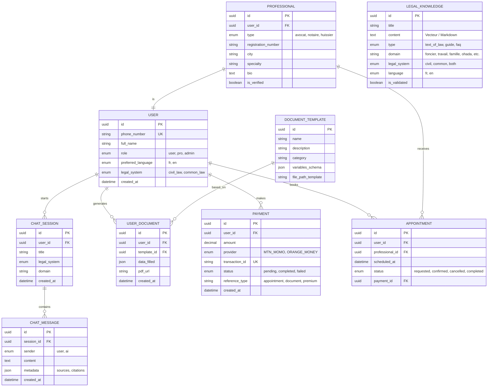

# Schéma de la Base de Données - JuristeIA Cameroun

Ce document décrit la structure de la base de données pour l'application d'aide à la décision juridique.

## Diagramme (ERD - Mermaid)

## Détails des Tables

### 1. `users`
Stocke les informations d'identification. La vérification se fait par SMS OTP sur le `phone_number`.
- `legal_system` : Déterminé lors de l'onboarding (ex: Région du Littoral -> Civil Law, Région du Sud-Ouest -> Common Law).

### 2. `chat_sessions` & `chat_messages`
Historique des échanges avec l'IA.
- Les métadonnées des messages stockent les références aux textes de loi utilisés par le RAG.

### 3. `legal_knowledge`
La base de connaissances pour le RAG.
- `is_validated` : Champ CRITIQUE. Indique si le contenu a été revu par un juriste camerounais.

### 4. `document_templates`
Modèles de documents (ex: contrat de bail).
- `variables_schema` définit les champs à remplir par l'utilisateur.

### 5. `professionals`
Annuaire des experts agréés. Seuls les comptes avec `role = 'pro'` y sont liés.

### 6. `payments`
Suivi des transactions Mobile Money.
